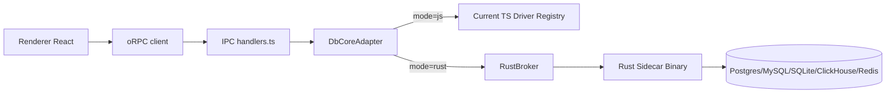

# TarsDB — Rust DB Core Migration Spec

Status: Draft
Owner: IPC/DB Team
Date: 2026-04-26

## 1. Summary

This document specifies an incremental migration of database-heavy backend functions from TypeScript to Rust in TarsDB, while preserving the existing Electron + React + oRPC architecture.

The migration is designed to:
1. Keep renderer contracts stable.
2. Avoid UI/main-process blocking.
3. Reduce risk with feature flags, fallback paths, and phased rollout.

## 2. Context

Current architecture already centralizes DB operations in `src/ipc/db/` and exposes them through oRPC handlers in `src/ipc/db/handlers.ts` and `src/ipc/db/index.ts`.

Current strengths:
1. Clear driver interface (`DatabaseDriver` in `src/ipc/db/driver.ts`).
2. DB logic concentrated in one backend module.
3. Renderer mostly decoupled via oRPC contracts.

Current pain points expected at scale:
1. CPU-heavy schema analysis and data processing in Node runtime.
2. Long-running operations competing with other main-process responsibilities.
3. Multi-driver code complexity for high-volume export/import and large result manipulation.

## 3. Goals

1. Improve performance predictability for heavy DB workloads.
2. Isolate crash-prone/high-load DB work from Electron main process.
3. Keep current oRPC API shape stable during migration.
4. Enable per-operation fallback to current TypeScript drivers.
5. Support progressive migration by engine and by operation.

## 4. Non-Goals

1. Rewriting renderer/UI in Rust.
2. Replacing oRPC transport.
3. Full rewrite of all DB logic in one release.
4. Immediate removal of existing TypeScript drivers.

## 5. Scope

### 5.1 In scope

1. New Rust sidecar core for selected DB operations.
2. Adapter layer in `src/ipc/db/` choosing JS or Rust implementation.
3. Contract and protocol for main process <-> Rust communication.
4. Build/package strategy for cross-platform binaries.
5. Observability, metrics, rollout flags, and fallback.

### 5.2 Out of scope (initially)

1. Local DB lifecycle management (`local-db-manager.ts`) full rewrite.
2. AI streaming IPC flows.
3. Preload boundary changes.

## 6. High-Level Architecture



Design principle: oRPC and handler contracts remain the stable boundary. Rust is introduced behind `DbCoreAdapter`.

## 7. Deployment Model Options

### 7.1 Chosen default: Rust sidecar process

1. Spawn a dedicated Rust binary from Electron main process.
2. Communicate via stdio using framed JSON-RPC messages.
3. Keep one sidecar process per app instance by default.
4. Optionally support one process per connection in future if needed.

Why default:
1. Better fault isolation than native in-process module.
2. Cleaner restart semantics after panic/crash.
3. Easier resource limits and watchdog behavior.

### 7.2 Secondary option: Node-API addon (`napi-rs`)

Supported as future option for ultra-low-latency hot paths, but not phase-1 default due to lower crash isolation.

## 8. Integration Points in Current Code

Primary files:
1. `src/ipc/db/handlers.ts`
2. `src/ipc/db/index.ts`
3. `src/ipc/db/driver.ts`
4. `src/ipc/db/registry.ts`
5. Engine-specific drivers in `src/ipc/db/*.ts`

New files/modules proposed:
1. `src/ipc/db/core/adapter.ts`
2. `src/ipc/db/core/mode.ts`
3. `src/ipc/db/core/rust-broker.ts`
4. `src/ipc/db/core/contracts.ts`
5. `src/ipc/db/core/telemetry.ts`
6. `native/db-core/` (Rust workspace/crate)

## 9. Operation Migration Matrix

Phase assignment by expected gain/risk.

### 9.1 Phase 1 (high gain, lower compatibility risk)

1. `getSchemaSummary`
2. `getTableSample`
3. `explainQuery`
4. `exportSchemaDdl`
5. `exportTableData`
6. `executeBatchDdl`
7. `importTableRows`

### 9.2 Phase 2

1. `executeQuery` (read-heavy paths first)
2. `listRows`
3. `getTableDetails`
4. `getSchema`

### 9.3 Phase 3

1. DDL mutations (`createTable`, `addColumn`, etc.)
2. Save/truncate/fk runtime helpers
3. Optional local branch workflows for PG

### 9.4 Keep in TS for now

1. Connection persistence (`connection-store.ts`)
2. UI-facing orchestration logic in handlers
3. Local embedded DB process bootstrapping in `local-db-manager.ts`

## 10. Adapter Design

`DbCoreAdapter` is responsible for runtime routing.

Modes:
1. `js` -> always use current TS implementation.
2. `rust` -> use sidecar; fallback to JS when allowed.
3. `mirror` -> execute Rust and JS for read-only operations, compare outputs, return JS output.

Routing key:
1. operation name
2. db_type
3. feature flag state

Proposed environment flags:
1. `TARS_DB_CORE_MODE=js|rust|mirror`
2. `TARS_DB_CORE_OPS=comma,separated,ops`
3. `TARS_DB_CORE_ENGINES=postgresql,mysql,sqlite,clickhouse,redis`
4. `TARS_DB_CORE_FALLBACK_ON_ERROR=true|false`

## 11. Main <-> Rust Protocol

Transport: stdio, line-delimited framed JSON.

Envelope:

```json
{
  "id": "uuid",
  "method": "db.get_schema_summary",
  "params": {
    "connection": { "dbType": "postgresql", "connectionString": "..." },
    "args": { "schema": "public" }
  },
  "meta": {
    "requestId": "orpc-request-id",
    "timeoutMs": 30000,
    "traceId": "trace-uuid"
  }
}
```

Success response:

```json
{
  "id": "uuid",
  "ok": true,
  "result": { "...": "typed payload" },
  "meta": { "elapsedMs": 42 }
}
```

Error response:

```json
{
  "id": "uuid",
  "ok": false,
  "error": {
    "code": "DB_TIMEOUT",
    "message": "Query timeout",
    "retryable": true,
    "details": { "driver": "postgresql" }
  },
  "meta": { "elapsedMs": 30001 }
}
```

Cancellation:
1. Main sends `method: "sys.cancel"` with target `id`.
2. Rust should propagate cancellation to DB driver if possible.
3. If not possible, Rust marks operation cancelled and drops result.

## 12. Data Contracts and Validation

1. Keep existing Zod schemas at oRPC input boundary.
2. Add Rust-side validation using Serde + typed structs.
3. Preserve current response shape from handlers to renderer.
4. Normalize error payloads through a single mapper in adapter.

Contract source of truth:
1. Existing TS types in `src/ipc/db/types.ts`.
2. Generated JSON schema snapshots for Rust parity tests.

## 13. Reliability Requirements

1. Sidecar startup timeout: 5s (configurable).
2. Per-request timeout default: 30s.
3. Automatic sidecar restart with exponential backoff.
4. Max restart attempts: 3 within 60s before circuit-open.
5. Circuit-open behavior: route to JS implementation when fallback enabled.

## 14. Performance Requirements

Initial SLO targets on representative datasets:
1. `getSchemaSummary`: p95 <= 500ms for medium DBs.
2. `listRows` (10k page size scenario): p95 <= current baseline - 25%.
3. `exportTableData` throughput: +30% over baseline.
4. Main process long task blocks (>50ms): reduce by >= 50% in heavy flows.

Measurement method:
1. Baseline benchmark on current TS implementation.
2. Same benchmark in `rust` mode.
3. Compare p50/p95/p99 and memory footprints.

## 15. Security Requirements

1. Do not log raw passwords or full connection strings.
2. Reuse existing sanitization behavior equivalent to `sanitizeErrorMessage`.
3. Keep secret handling in main/backend only; never expose to renderer.
4. Sign and checksum shipped sidecar binaries.
5. Verify sidecar executable path is from trusted app resources.

## 16. Packaging and Distribution

### 16.1 Artifacts

1. Build Rust binary per platform/arch used by releases.
2. Output naming:
3. macOS/Linux: `tarsdb-core`
4. Windows: `tarsdb-core.exe`

### 16.2 Placement

1. Place artifacts in app resources under `native/db-core/<platform-arch>/`.
2. Ensure unpacking rules for executable binaries.

### 16.3 Release pipeline tasks

1. Cross-build binaries in CI.
2. Attach checksums and build metadata.
3. Codesign/notarize where required.
4. Smoke-test startup and query per platform.

Note: any `forge.config.ts` packaging/fuse updates require explicit approval before implementation.

## 17. Observability

Required structured events:
1. `db_core.request.start`
2. `db_core.request.end`
3. `db_core.request.error`
4. `db_core.sidecar.start`
5. `db_core.sidecar.exit`
6. `db_core.fallback.triggered`
7. `db_core.mirror.diff`

Required fields:
1. `operation`
2. `dbType`
3. `mode`
4. `elapsedMs`
5. `success`
6. `errorCode`
7. `requestId`

## 18. Backward Compatibility

1. oRPC method names and payloads remain unchanged.
2. Existing renderer calls remain unchanged.
3. Feature flag default is `js` until parity gates are met.
4. Rust failures must not break user flow when fallback is enabled.

## 19. Testing Strategy

### 19.1 Contract tests

1. Generate fixture inputs from current handlers.
2. Assert TS and Rust outputs are shape-compatible.
3. Snapshot normalized outputs for deterministic operations.

### 19.2 Differential tests (`mirror` mode)

1. Run read-only operations in both engines.
2. Compare normalized payloads.
3. Emit diff telemetry with bounded sample payload.

### 19.3 Integration tests

1. Postgres, MySQL, SQLite, ClickHouse matrix in CI.
2. Failure cases: timeout, network loss, invalid SQL, auth errors.
3. Restart scenarios: forced sidecar crash and recovery.

### 19.4 E2E smoke tests

1. Connect -> schema load -> query -> export -> import.
2. Verify no renderer regressions.

## 20. Rollout Plan

### Milestone A — Foundation

1. Implement adapter and mode flags.
2. Implement sidecar lifecycle manager.
3. Add telemetry and baseline benchmarks.

Exit criteria:
1. App works in `js` mode with zero behavior change.
2. Sidecar can start/stop reliably in development.

### Milestone B — Read-only heavy operations

1. Implement Rust for phase-1 read/export ops.
2. Enable `mirror` in internal builds.

Exit criteria:
1. >= 99% parity on contract tests.
2. No critical diff in mirror for 7 days internal usage.

### Milestone C — Controlled production enablement

1. Enable `rust` mode for selected operations + Postgres first.
2. Expand by engine after stability window.

Exit criteria:
1. Performance targets met.
2. Error rate not worse than baseline.

### Milestone D — Broader operation coverage

1. Migrate remaining high-value operations.
2. Keep JS fallback path until two stable releases.

## 21. Risks and Mitigations

1. Risk: Cross-platform packaging complexity.
2. Mitigation: deterministic CI matrix + signed artifacts + startup smoke tests.

3. Risk: Contract drift between TS and Rust.
4. Mitigation: shared fixtures + mirror mode + strict schema validation.

5. Risk: Increased operational complexity.
6. Mitigation: feature flags, staged rollout, fallback to JS.

7. Risk: Driver behavior differences by engine.
8. Mitigation: per-engine enablement and parity gates.

## 22. Open Decisions

1. Rust DB driver stack per engine (single crate vs per-engine crates).
2. Message format choice for large payloads (JSON vs MessagePack).
3. Whether to add optional compression for large row payloads.
4. Whether exports should move to async job model with polling APIs.
5. Long-term decision on `napi-rs` for specific ultra-hot paths.

## 23. Proposed Initial Task Breakdown

1. Create `DbCoreAdapter` skeleton and `mode` flags.
2. Add no-op `RustBroker` with healthcheck method.
3. Wire one operation behind adapter (`getSchemaSummary`).
4. Add mirror-mode comparator for this operation.
5. Add telemetry events and benchmark harness.
6. Expand operation coverage after parity validation.

## 24. Acceptance Criteria for This Spec

1. Maintains current renderer/oRPC contracts.
2. Defines phased migration with fallback.
3. Defines protocol, reliability, security, and packaging requirements.
4. Defines measurable performance and rollout gates.
5. Is implementable within current `src/ipc/db` architecture.

